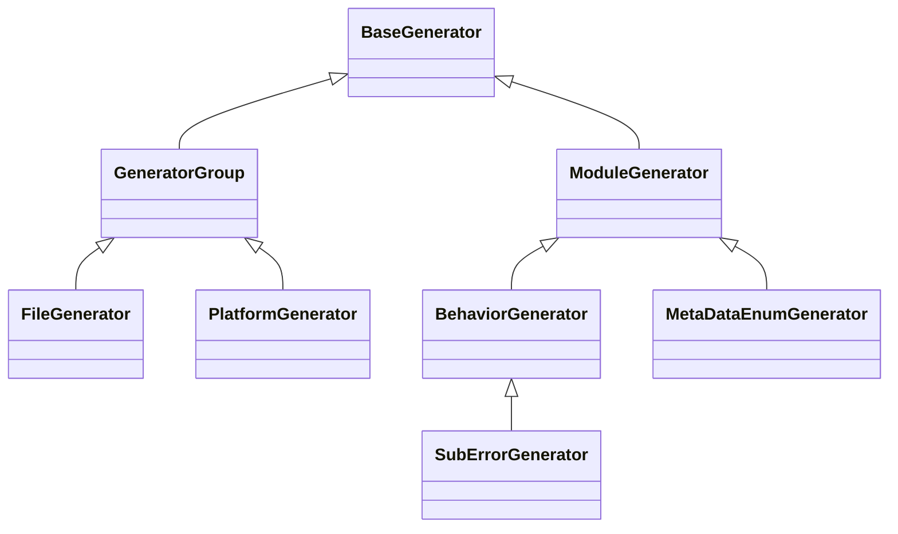

# Error Code Tools for Lynx.

## Quick Start

Define Lynx's Error Code in the [error_code.yaml](./error_code.yaml) with a `yaml` format.

Then run `python tools/error_code/gen_error_code.py` to generate error code file for C++, Java, Objective-C, TypeScript.

## How to add a new error section

In the [error_code.yaml](./error_code.yaml) file, find the `sections` field. This field is a list of sections. When you need to add a new section, you can append a new section after the definition of the last section in the sections list. Each section has a `unique number`, which corresponds to the `high-code` field under the section. 
It should be noted that the unique number of a new section cannot exceed two digits and must be greater than the number of the previous section.
``` yaml
# example
sections:
  - name: Resource
    description: 'Resource related errors.'
    high-code: 3
    behaviors: # ignore the definition of behaviors
```

## How to add a new error behavior

Under the `behaviors` field of the corresponding `section`, you can add an error behavior. Similar to adding a section, each behavior has a unique number `mid-code` within the scope of its own section. The number of the newly added behavior should be greater than that of the previous behavior. The number of an error behavior also cannot exceed two digits.
``` yaml
behaviors:
    - name: ImageLoadFailed
      mid-code: 1
      level: error
      codes: # ignore the definition of codes
```

You can specify the values of some metadata for a behavior. The metadata that can be specified is declared in the `meta-data` field in [error_code.yaml](./error_code.yaml).

When you specify the value of metadata for a behavior, the sub error code under the behavior will automatically inherit the metadata of the behavior. However, the priority of the metadata value of the behavior is lower than that of the metadata value of the sub error code itself.

For example, if the `level` of behavior A is error and the level of sub error code AA is warn, and sub error code AA belongs to behavior A, then the actual value of the level of sub error code AA is warn. If we only specify the value of level as error for behavior A and do not specify the value of level for sub error code AA, then the level of the sub error code is error.

If neither the value of metadata is specified for a behavior nor for its sub error code, then when generating code, the default value of metadata will be automatically used.

## How to add a new sub error code

Under a behavior, several sub error codes can be defined. Within the scope of its own behavior, a sub error code has a unique number, low-code. Just like sections and behaviors, the number of a newly added sub error code should be greater than that of the previous sub error code.The number of a sub error code also cannot exceed two digits.

You can specify the value of metadata for a sub error code. For specific reference, see "How to add a new error behavior".
``` yaml
codes:
    - name: InvalidImageUrl
      low-code: 1
      description: 'Failed to load image caused by invalid url'
      fix-suggestion: 'Please check the image url'
      consumers:
          - front-end
```

## How to declare a new meta data for error code

All metadata is declared in the `meta-data` field in the [error_code.yaml](./error_code.yaml) file. The declaration of metadata includes the following contents.

- name: Used to generate a name in the code file and needs to conform to upper camel case.
- type: Selectable types are `string`, `number`, `bool`, and `enum`.
- keyword: Declares the keyword of this metadata in the definition of behavior and sub error code.
- default: The default value of this metadata. When neither behavior nor sub error code specifies the value of this metadata, this default value will be used.
- values: Only required for enum types. Defines the possible values of enum types.
- multi-selection: Only required for enum types. Indicates whether the values of this enum can be multi-selected. If this field is not defined, by default, multi-selection is not allowed.
``` yaml
meta-datas:
    - name: Consumer
      type: enum
      keyword: consumers
      multi-selection: true
      values:
        - front-end
        - client
        - lynx
      default:
        - front-end
        - client
        - lynx
```

## How to add script for a new file language

We have prepared some base classes for the script. The relationships of these base classes are as follows:





These base classes predefine process functions for traversing the [error_code.yaml](./error_code.yaml) file, such as

- before_generate
- before_gen_section
- before_gen_behavior
- on_next_sub_code
- after_gen_behavior
- after_gen_section
- on_next_meta_data

They also automatically generate common comments. As long as you inherit the corresponding base class and implement the corresponding methods, you can quickly implement an error code generation script for a new language. For specific reference, see the generation scripts under the `impl/android` directory.
